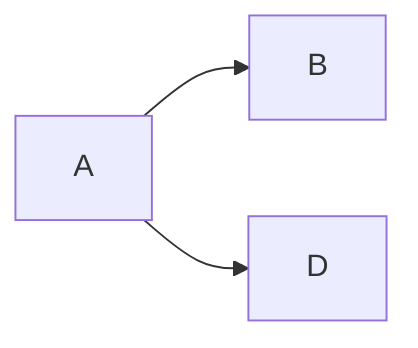

# Mermaid 增强

Mermaid 是一个基于 JavaScript 的图表绘制工具，通过解析类 Markdown 的文本语法来实现图表的创建和动态修改。

## 安装依赖

首先安装依赖 [hexo-filter-mermaid-diagrams](https://github.com/jueinin/hexo-filter-mermaid-diagrams)：

```bash
npm install hexo-filter-mermaid-diagrams
```

## 配置

在配置文件中启用：

```yml
mermaid:
  enable: true # 启用 Mermaid 增强
  version: 10.9.3 # 固定版本，避免使用 latest 因上游 breaking change 失效
  options:
    startOnload: true
```

## 配置项说明

| 字段 | 说明 |
| --- | --- |
| `mermaid.enable` | 启用 Mermaid 增强 |
| `mermaid.version` | Mermaid 版本号 |
| `mermaid.options` | 传给 Mermaid 的初始化选项 |

## 版本固定说明

`version` 必须固定为具体版本号（默认 `10.9.3`），避免使用 `latest`。Mermaid 11.x 改为 ESM 模块，需要使用 `type="module"` 加载，与 10.x 不兼容；固定版本可以避免上游 breaking change 导致图表渲染失效。

## mermaid.run() 与 init() 兼容

主题对不同版本的 Mermaid 初始化 API 都做了兼容处理：

- Mermaid 10.x+ 使用 `mermaid.run()`
- Mermaid 9.x 使用 `mermaid.init()`

主题在加载 Mermaid 后会优先调用 `mermaid.run()`，若不存在则回退到 `mermaid.init()`，因此即便用户切换版本，图表仍可正常渲染。

## 使用方法

在 markdown 文章中使用代码块语法绘图（GitHub 会自动渲染，用法就是把代码块语言设置为 `mermaid`）：

````markdown

````

## 本地预览

如果想要在本地预览 mermaid 的渲染结果，需要支持 mermaid 的 markdown 编译器。如果使用 VS Code，需要下载 [Markdown Preview Mermaid Support](https://marketplace.visualstudio.com/items?itemName=bierner.markdown-mermaid) 插件。

Mermaid 的具体用法可参考 [Mermaid 指引](http://mermaid.js.org/intro/)。
