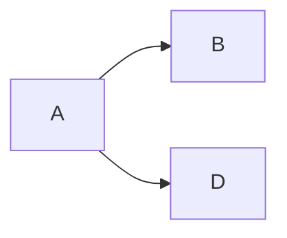

# Mermaid Enhancement

Mermaid is a JavaScript-based diagramming tool that parses Markdown-like text syntax to create and dynamically modify diagrams.

## 1. Install the dependency

```bash
npm install hexo-filter-mermaid-diagrams
```

## 2. Enable in the config

```yml
mermaid:
  enable: true # enable Mermaid
  version: 10.9.3 # pin the version to avoid breakage from upstream "latest"
  options:
    startOnload: true
```

## 3. Draw diagrams in markdown

Now you can draw diagrams in markdown posts (GitHub renders them automatically — use a `mermaid` code block):



## Previewing Mermaid locally

To preview Mermaid rendering locally, you need a markdown compiler that supports Mermaid. For VS Code, install [Markdown Preview Mermaid Support](https://marketplace.visualstudio.com/items?itemName=bierner.markdown-mermaid).

See the [Mermaid guide](http://mermaid.js.org/intro/) for usage details.
