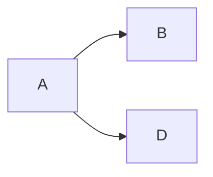

# Mermaid Enhancement

Mermaid is a JavaScript-based diagramming tool that parses Markdown-like text syntax to create and dynamically modify diagrams.

## 1. Install the dependency

```bash
npm install hexo-filter-mermaid-diagrams
```

## 2. Enable in the config

```yml
mermaid:
  enable: true # enable Mermaid
  version: 10.9.3 # pin the version to avoid breakage from upstream "latest"
  url: # optional, full script URL (local path or any reachable CDN); empty = default jsDelivr
  options:
    startOnload: true
```

### Custom script source

By default Mermaid is loaded from jsDelivr (`theme.cdn` or `https://cdn.jsdelivr.net/npm`). jsDelivr is unreachable in some networks (e.g. mainland China direct connection), which leaves diagrams stuck as raw text. Point `mermaid.url` to a reachable source instead:

```yml
# Local file (recommended: download mermaid.min.js into source/vendors/ — zero external dependencies)
mermaid:
  enable: true
  url: /vendors/mermaid.min.js
```

```yml
# Or a full URL of another CDN
mermaid:
  enable: true
  url: https://registry.npmmirror.com/mermaid/10.9.3/files/dist/mermaid.min.js
```

When the script source is unreachable, the theme shows a visible failure notice at the top of the post body (instead of waiting forever), keeping the raw text readable.

## 3. Draw diagrams in markdown

Now you can draw diagrams in markdown posts (GitHub renders them automatically — use a `mermaid` code block):



## Previewing Mermaid locally

To preview Mermaid rendering locally, you need a markdown compiler that supports Mermaid. For VS Code, install [Markdown Preview Mermaid Support](https://marketplace.visualstudio.com/items?itemName=bierner.markdown-mermaid).

See the [Mermaid guide](http://mermaid.js.org/intro/) for usage details.
